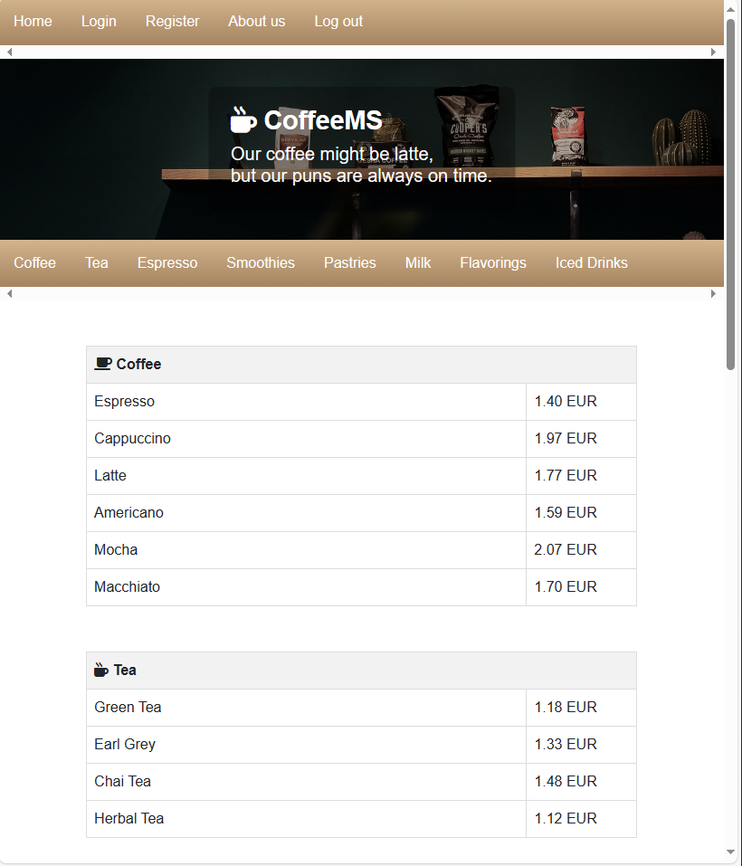
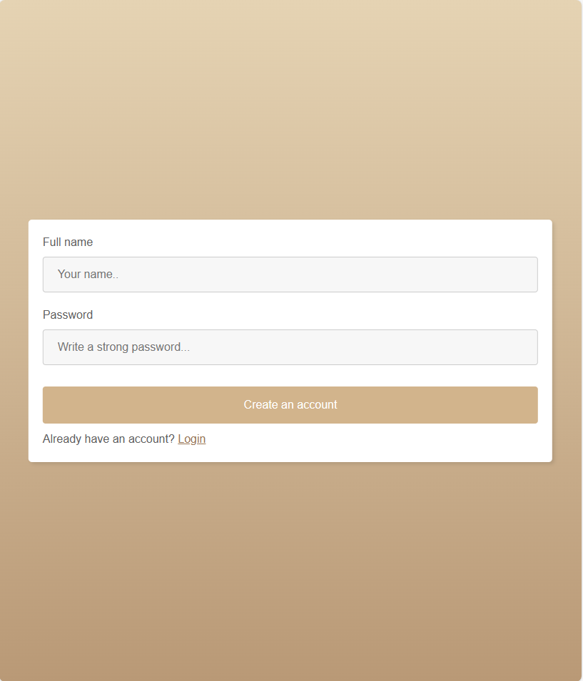
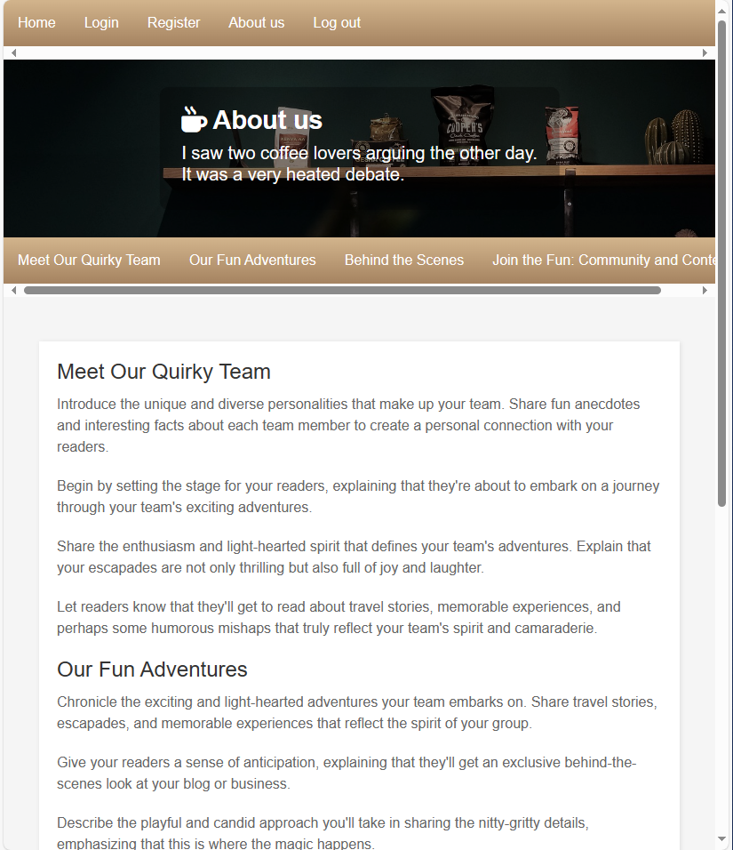

# CoffeeMS

Php app


## Init docker

```sh
# Build image
docker build -t cms-img .

# Run container
docker run cms-img

# OR run and forward port 3000 to localhost:3000
docker run -p 127.0.0.1:3000:3000 cms-img

# OR start it as a background process
docker run -dp 127.0.0.1:3000:3000 cms-img

# List docker containers
docker ps
```

## Zadaci

### Zadatak 1 - Init, routing

Naslovna stranica i routing na ostale (ostale ne moraju nužno biti napravljene)

https://lms-2020.tvz.hr/mod/resource/view.php?id=5957

### Zadatak 2 - Baza podataka

Izrada baze podataka na temelju definicije podataka.

### Zadatak 3 - Prijava i registracija

? Omogućiti automatsko generiranje usernamea i passworda?

+ Kriptiranje lozinke

### Zadatak 4 - CMS sustav

CRUD korisnika - ADMIN
CRUD pića - ADMIN, EDITOR
API pretraživanje koktela - ADMIN, EDITOR


## Upute

Instalacija XAMPPa na linuxu

```shell

# Download the installer from https://www.apachefriends.org/download.html

# If you haven't, install net-tools
sudo apt install net-tools

# Change permissions to the installer and run it
chmod 755 xampp-linux-*-installer.run
sudo ./xampp-linux-*-installer.run

# Start / stop XAMPP
sudo /opt/lampp/lampp start
sudo /opt/lampp/lampp stop

# Now open http://localhost
# This will use /var/www/html as server's root folder

# GUI tool
cd /opt/lampp
sudo ./manager-linux-run (or manager-linux-64.run)

```

## Design

#### Home page


#### Login


#### Register


#### About us

