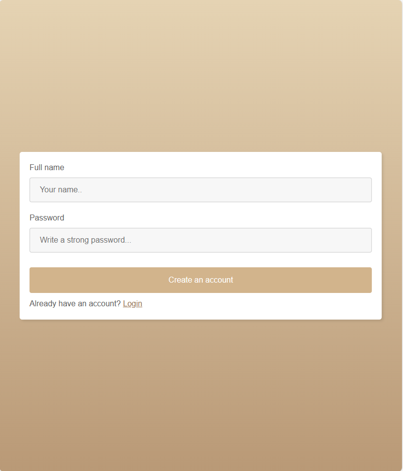

# CoffeeMS

A simple coffee shop CMS.

Made with XAMPP - PHP version 8.2.4

Once you start the XAMPP server, you should:

```sh
# Navigate to XAMPP's htdocs (adjust for your machine):
cd C:/xampp/htdocs

# Clone the project into it
git clone https://github.com/shtef21/CoffeeMS

# Initialize the database by running coffeems.sql inside phpmyadmin,
# or by visiting this url:
#     http://localhost/CoffeeMS/api/initialize_or_reset_db.php

# Your app should be live!
# Check it out by visiting http://localhost/CoffeeMS
```

## TODO

- Add comments where needed
- Update README with latest screenshots

## Upute

Instalacija XAMPPa na linuxu

```shell

# Download the installer from https://www.apachefriends.org/download.html

# If you haven't, install net-tools
sudo apt install net-tools

# Change permissions to the installer and run it
chmod 755 xampp-linux-*-installer.run
sudo ./xampp-linux-*-installer.run

# Start / stop XAMPP
sudo /opt/lampp/lampp start
sudo /opt/lampp/lampp stop

# Now open http://localhost
# This will use /var/www/html as server's root folder

# GUI tool
cd /opt/lampp
sudo ./manager-linux-run (or manager-linux-64.run)

```

## Design

#### Home page


#### Login


#### Register


#### About us

