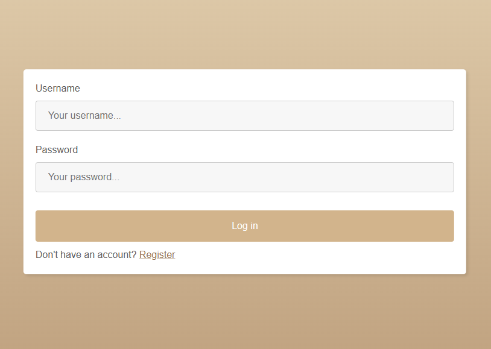

# CoffeeMS

A simple content-management system web application made for small cafes.

Presentation: [Canva](https://www.canva.com/design/DAF0tjdzbsg/VDE9lqKu9bKDlSqtudCqzg/view?utm_content=DAF0tjdzbsg&utm_campaign=designshare&utm_medium=link&utm_source=editor)


## Design

#### Home page


#### Login page


#### About us


#### Cocktail finder


## Run it on your machine

You can check the app for yourself in 3 steps

### 1. Install XAMPP (PHP 8.2.4) and start Apache & MySQL:

https://www.apachefriends.org/download.html

### 2. Clone the repo in XAMPP htdocs

`htdocs` is a folder in which XAMPP stores its web pages.

```sh
# htdocs path may be different for your machine
cd C:/xampp/htdocs

git clone https://github.com/shtef21/CoffeeMS
```

### 3. Initialize the database

- Run `coffeems.sql` as a query in http://localhost/phpmyadmin

### Your app should be live!
Check it out by visiting http://localhost/CoffeeMS

You can login with superuser **admin/admin** and **user/user** (username/password).


