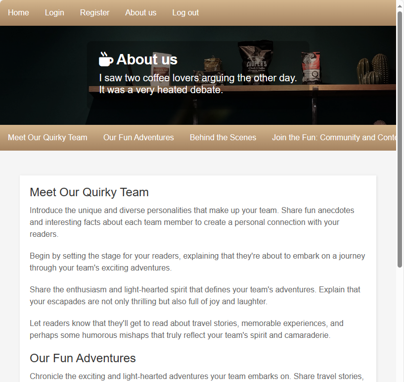

# CoffeeMS

A simple coffee shop CMS.


## Run it on your machine

You can check the app for yourself in 3 steps

### 1. Install XAMPP (PHP 8.2.4) and start Apache & MySQL:

https://www.apachefriends.org/download.html

### 2. Clone the repo in XAMPP htdocs

`htdocs` is a folder in which XAMPP stores its web pages.

```sh
# htdocs path may be different for your machine
cd C:/xampp/htdocs

git clone https://github.com/shtef21/CoffeeMS
```

### 3. Initialize the database

- Either by running `coffeems.sql` as a query in http://localhost/phpmyadmin
- Or by visiting http://localhost/CoffeeMS/api/initialize_or_reset_db.php

### Your app should be live!
Check it out by visiting http://localhost/CoffeeMS


## Design

#### Home page


#### Login page


#### About us


#### Cocktail finder


## Install XAMPP on linux

```shell

# Download the installer from https://www.apachefriends.org/download.html

# If you haven't, install net-tools
sudo apt install net-tools

# Change permissions to the installer and run it
chmod 755 xampp-linux-*-installer.run
sudo ./xampp-linux-*-installer.run

# Start / stop XAMPP
sudo /opt/lampp/lampp start
sudo /opt/lampp/lampp stop

# Now open http://localhost
# This will use /var/www/html as server's root folder

# GUI tool
cd /opt/lampp
sudo ./manager-linux-run (or manager-linux-64.run)

```